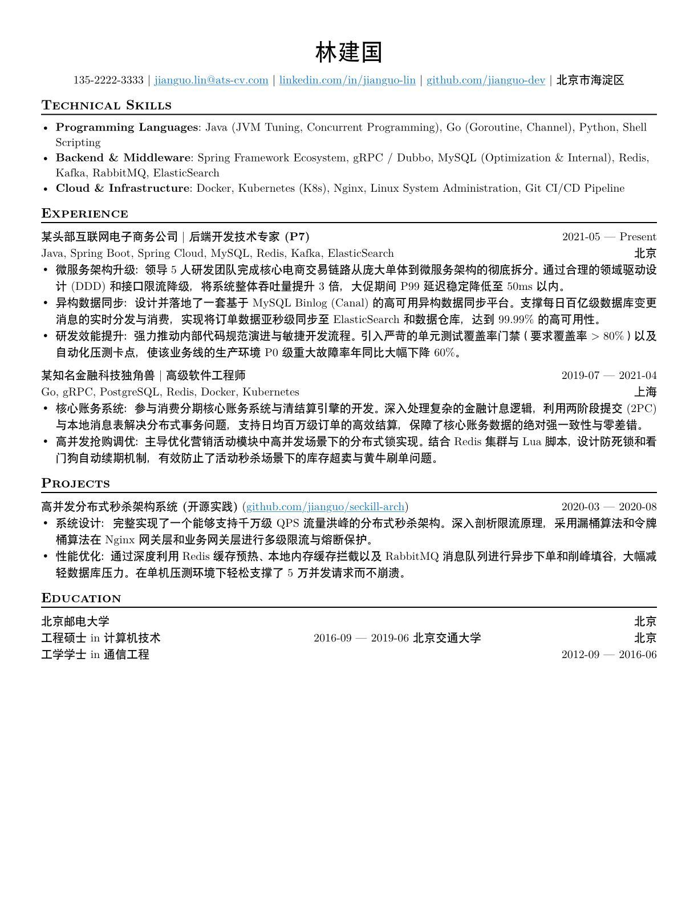
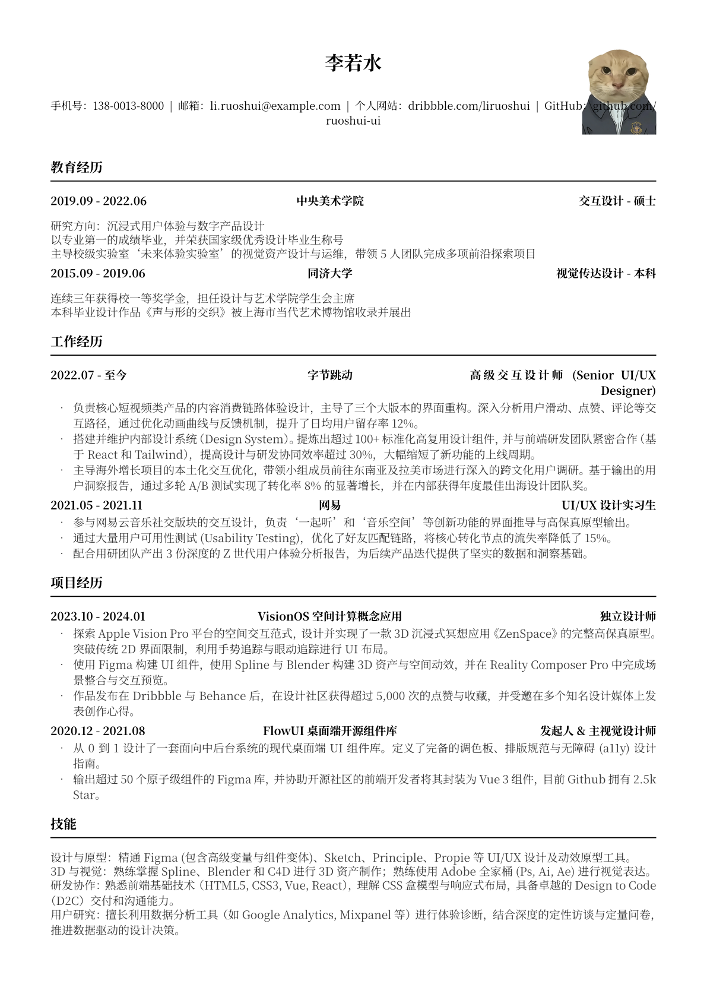
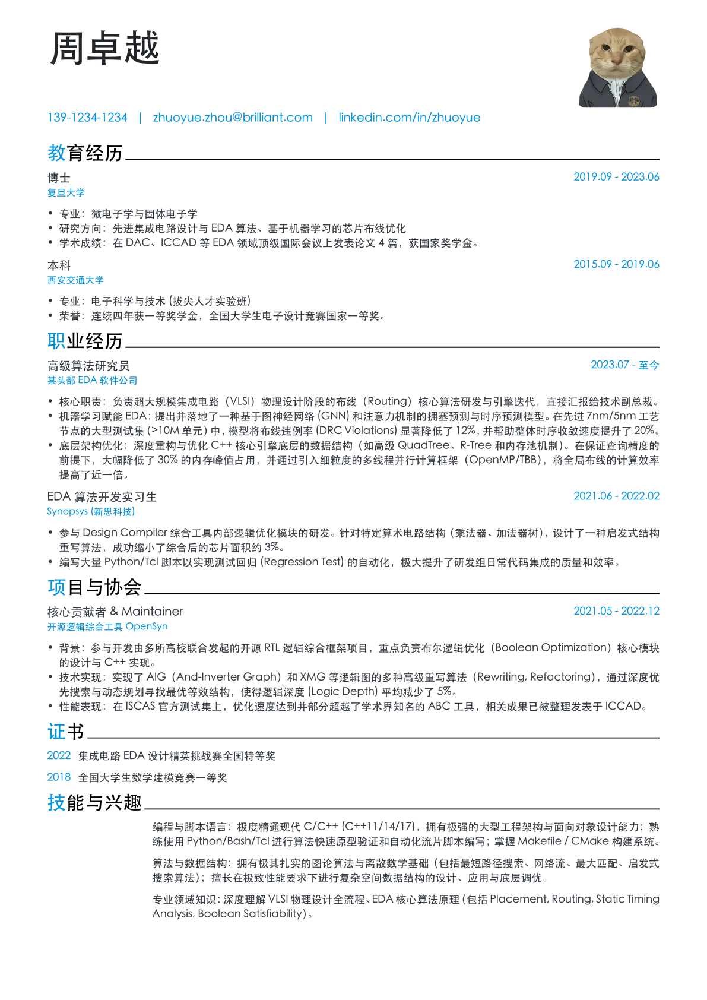
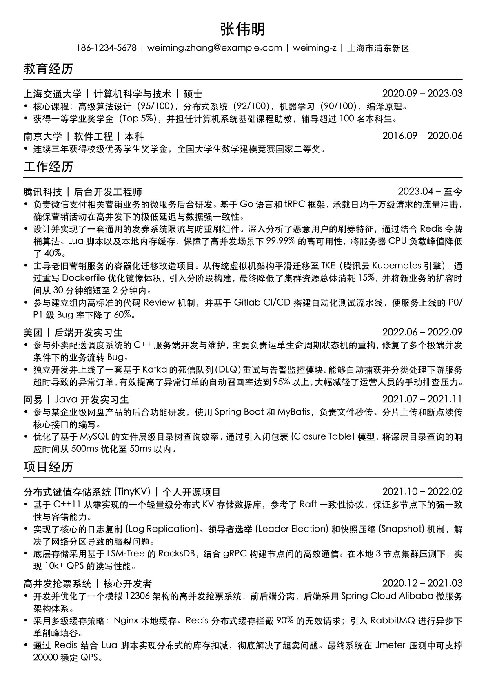
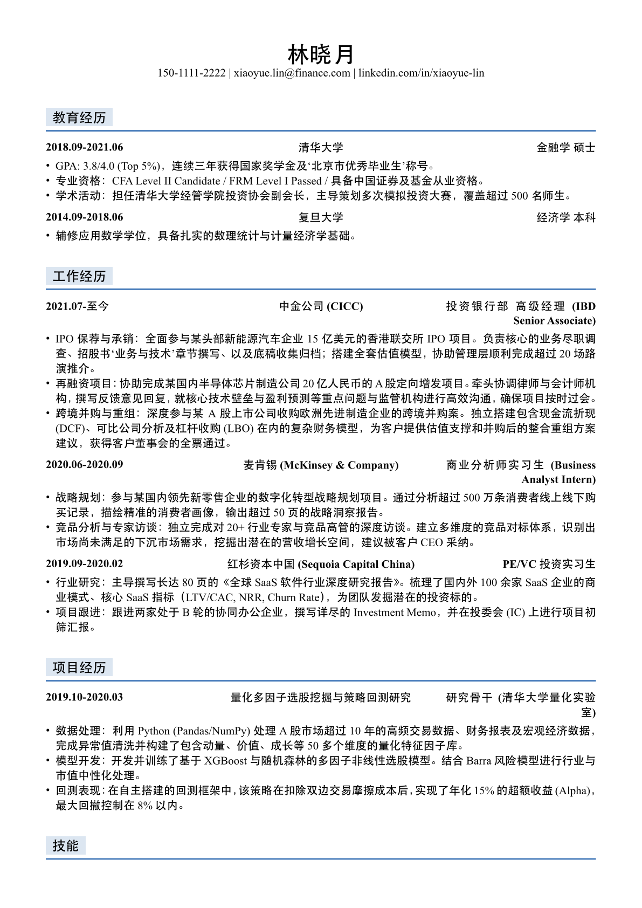
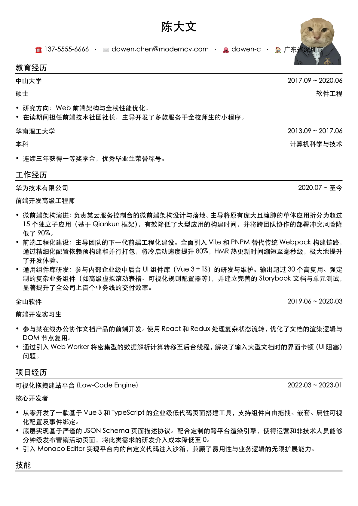
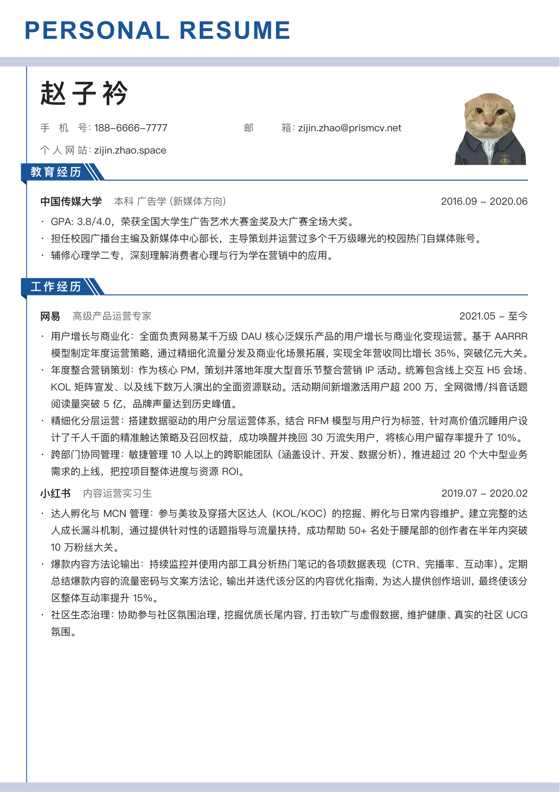
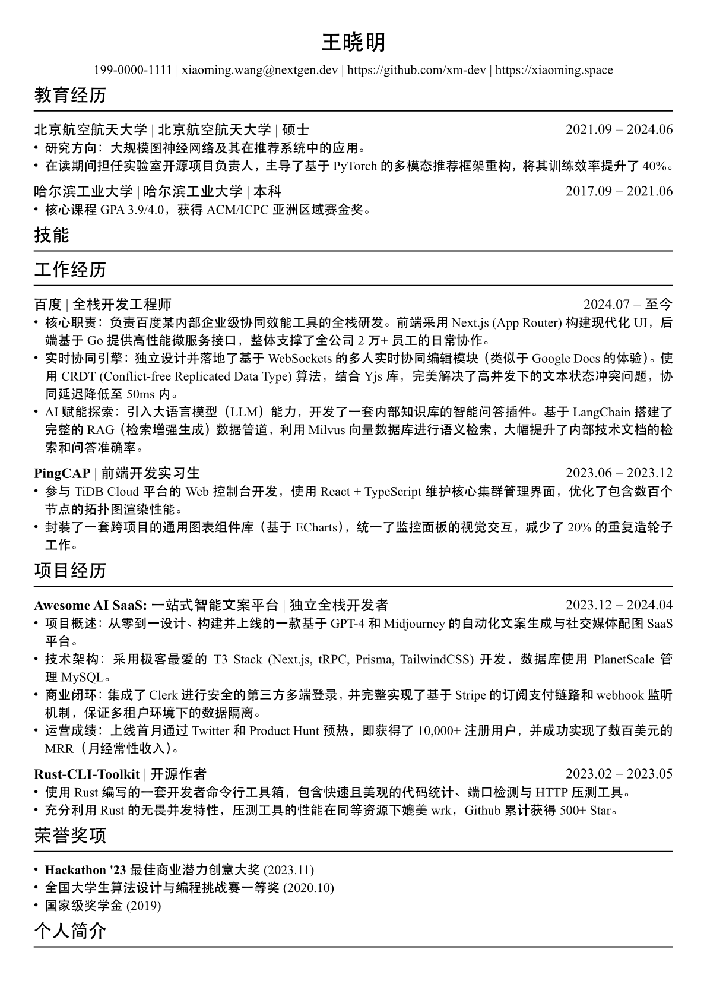
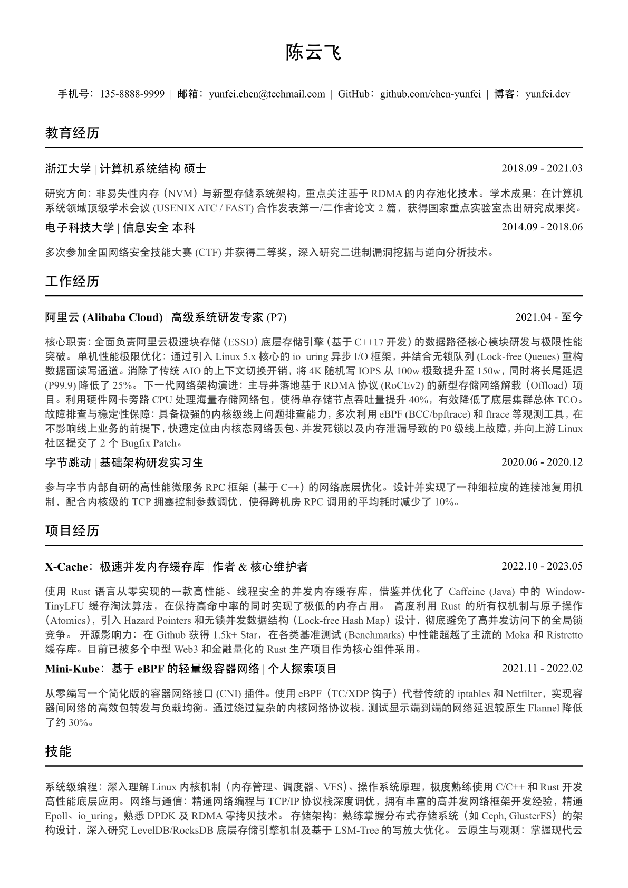

<div align="center">
  
  
  # 🎓 Typst Resume Studio

</div>

一个基于 [Typst](https://typst.app) 构建的**数据驱动型**开源简历模板框架。通过完全分离**简历数据 (YAML)** 与**排版样式 (Typst)**，让你可以像填表一样写简历，同时轻松切换不同的精美主题。

> 如果你喜欢这个项目，欢迎给它一个 ⭐ Star！
> 每一个 Star 都是对项目最大的鼓励，也会让我更有动力持续更新和完善它。🚀

## ✨ 特性

- 📝 **完全数据驱动**：所有的个人信息、经历、项目都在 `data.yml` 中维护。对非程序员极度友好！
- 🎨 **多主题支持**：内置多套主题，一键导出。
- 🧩 **超高扩展性**：主题统一接收数据字典，自由扩展如“荣誉奖项”、“技能清单”等自定义区块，无需修改底层核心接口。

## 🚀 快速开始

确保已安装 [Typst CLI](https://github.com/typst/typst)。

```bash
# 编译主简历 (使用 resume.typ 中指定的主题)
typst compile resume.typ

# 若使用本地 fonts/ 目录中的字体，需显式指定字体路径
typst compile resume.typ --font-path fonts

# 预览特定主题 (以 modern 为例)
typst compile themes/modern/example.typ --root .
```

## 🛠️ 自动化工具 (`compile_previews.py`)

项目内置了一个 Python 脚本，用于批量生成主题预览图和管理文档。

### 环境依赖

- Python 3.x
- Typst CLI

### 常用命令

```bash
# 1. 为所有主题生成简历预览 (默认使用 data.yml，输出到 previews/ 目录)
python compile_previews.py --preview

# 2. 使用指定的数据文件 (如 my_data.yml) 为所有主题生成预览
python compile_previews.py --preview -f my_data.yml

# 3. 严格字体检查：主题声明字体缺失时直接失败
python compile_previews.py --preview --strict-fonts
```

## Font 配置与排错

项目支持全局字体优先，主题字体兜底：

```yaml
global-font:
    # 按顺序回退
    fonts: ["Noto Serif SC"]
```

注意事项：

1. 字体族名称必须与 Typst 识别到的名称完全一致。
2. 如果字体放在仓库 `fonts/` 目录，`typst compile` 时必须加 `--font-path fonts`。
3. 可用如下命令查看 Typst 实际识别到的字体族：

```bash
typst fonts --font-path fonts
```

4. 批量预览推荐开启严格模式，缺失字体会明确报错：

```bash
python compile_previews.py --pdf --strict-fonts
```

## 🎨 主题

本项目内置精美主题，可通过修改 `resume.typ` 中的 import 语句快速切换。

| Ats Friendly | Avatar Pro | Brilliant Cv |
| :---: | :---: | :---: |
|  |  |  |
| Classic | Finance Blue | Modern |
|  |  |  |
| Prism | Resume Ng | Tech Pro |
|  |  |  |

## 🎨 开发新主题

想要为这个项目贡献自己的主题设计？非常欢迎！

### 快速指南

1. **核心文件**：
    - `themes/module-core.typ` - 模块化渲染协议和工具函数
    - `themes/DEVELOP.md` - 完整的主题开发规范文档

2. **目录结构**：

    ```
    themes/your-theme/
    ├── template.typ    # 主题渲染逻辑，导出 blueprint() 函数
    └── example.typ     # 独立预览入口
    ```

3. **推荐方式**：使用模块化协议

    ```typst
    #import "../module-core.typ": standard-modules

    #let blueprint(data: (:), body) = {
      let modules = standard-modules(data)

      for module in modules {
        if module.id == "resume-info" { /* 渲染头部 */ }
        else if module.id == "education" { /* 渲染教育 */ }
        else if module.id == "projects" { /* 渲染项目 */ }
        else if module.id == "internship" { /* 渲染实习 */ }
        else { /* 通用渲染 */ }
      }
    }
    ```

4. **支持的模块**：
    - `resume-info` - 个人信息
    - `education` - 教育经历
    - `experience` - 工作经历
    - `projects` - 项目经历
    - `internship` - 实习经历
    - `skills` - 个人技能
    - `awards` - 荣誉奖项
    - `certificates` - 资质证书

5. **测试主题**：
    ```bash
    typst compile themes/your-theme/example.typ --root .
    ```

📖 **详细文档**：请查看 [themes/DEVELOP.md](themes/DEVELOP.md) 了解完整的开发规范、数据格式、最佳实践等。

欢迎提交 PR 分享你的设计！🎉
